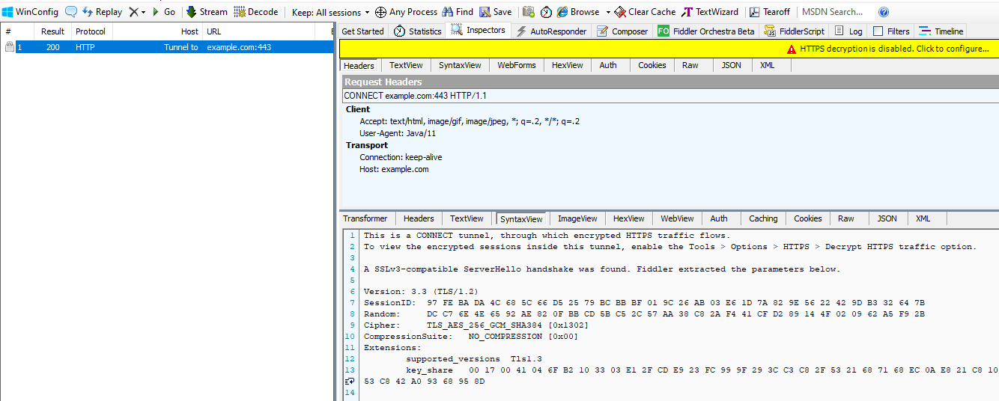
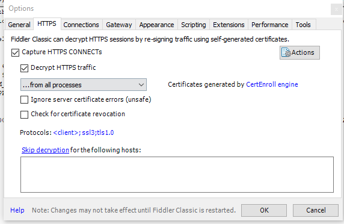
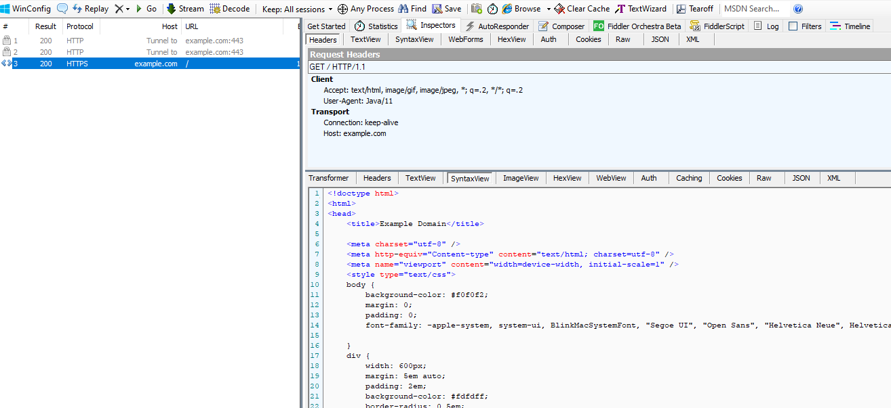

# java-fiddler-https

[https://docs.telerik.com/fiddler/configure-fiddler/tasks/decrypthttps](https://docs.telerik.com/fiddler/configure-fiddler/tasks/decrypthttps)

[https://docs.telerik.com/fiddler/configure-fiddler/tasks/configurejavaapp](https://docs.telerik.com/fiddler/configure-fiddler/tasks/configurejavaapp)

## avant

## conf https

## après

# rappel

